# OpenVisionLab 3D Studio

### Build, teach, review, and replay rule-based 3D inspection recipes on Windows

[](https://github.com/Noah8218/OpenVisionLab-3D-Studio/actions/workflows/ci.yml)


OpenVisionLab 3D Studio is a rule-based 3D inspection workbench for C3D height
data and common mesh or point-cloud formats. It brings source review, ROI
teaching, inspection parameters, result overlays, and reusable recipes into one
desktop workflow.


## Inspection workflow

```mermaid
flowchart LR
    Source["Open 3D data"] --> Quality["Review source quality"]
    Quality --> Tool["Add an inspection tool"]
    Tool --> Reference["Teach the reference ROI"]
    Reference --> Measurement["Teach the measurement ROI"]
    Measurement --> Parameter["Set parameters"]
    Parameter --> Preview["Preview"]
    Preview --> Review["Review metrics and overlays"]
    Review --> Run["Run all"]
    Run --> Save["Save and reopen the recipe"]
```



- Edit the same ROI in the Surface and full-resolution Height Image views.
- Move ROI candidates through `Missing → Drawing → Review → Applied`.
- Keep Preview and Run as explicit actions.
- Save step order, inputs, parameters, ROI roles, and output identities.
- Pin outputs for A/B/C comparison or open side-by-side, stacked, and pop-out
  Viewer layouts.

## Try the included Thickness example

The repository includes an eight-pad Thickness recipe that is ready to open and
inspect.


- Grid: `1280 × 840`
- Layout: eight independently inspectable pads in a `4 × 2` arrangement
- Recipe: eight Thickness steps and 16 independently editable ROIs
- ROI pairing: each reference and measurement ROI stays inside the same pad

Open:

```text
3D/Samples/ThicknessCouponV1/inspection-recipe.ov3d-recipe.json
```

## Main features

| Area | Capability |
| --- | --- |
| Input | C3D, glTF/GLB, STL, LAS/LAZ |
| 3D Viewer | Surface default, Points/Wireframe/Edges, Top/Perspective, Fit all/Fit ROI |
| Height Image | Full native grid, Fit/1:1/Zoom/Pan, shared hover, invalid-cell display |
| ROI | Reference and Measurement `GridRectangle`, Review/Apply/Cancel/Delete, linked 2D/3D editing |
| Inspection workspace | Tool Catalog → Recipe Chain → Selected Tool → Viewer |
| Measurement | Thickness, Warpage, Plane Flatness, Point Pair, Gap/Flush, Volume, and more |
| Matching | Deterministic Surface Match with retained identified results, direct selection, and bounded Previous/Next Viewer review |
| Evidence | Explicit Preview/Run, state, metrics, overlays, reports, and headless Runner |
| Recipe | Save and restore step order, inputs, parameters, ROI roles, and output IDs |

## Requirements and setup

For the self-contained Windows package:

- Windows 10 build 19041 or later, or Windows 11, on x64
- OpenGL-compatible GPU with a current vendor driver

The self-contained package includes the .NET runtime. Application operators do
not need Git, Python, the .NET SDK, or FFmpeg.

Building and fully verifying the source additionally requires Git, Windows
PowerShell 5.1 or later, the .NET 10 SDK `10.0.300` or later, and Python 3.13.
Check the current machine without changing it:

```powershell
powershell -NoProfile -ExecutionPolicy Bypass -File scripts\setup-development-environment.ps1 -CheckOnly
```

Explicitly install missing development and verification utilities from their
fixed `winget` package IDs:

```powershell
powershell -NoProfile -ExecutionPolicy Bypass -File scripts\setup-development-environment.ps1 -InstallMissing
```

See [System requirements and setup](docs/OPENVISIONLAB_3D_SYSTEM_REQUIREMENTS_AND_SETUP.md)
for the operator/developer boundary, exact package IDs, and recovery steps.

## Build and run

```powershell
git clone https://github.com/Noah8218/OpenVisionLab-3D-Studio.git
cd OpenVisionLab-3D-Studio
dotnet build OpenVisionLab.ThreeDStudio.sln -c Debug -p:Platform="Any CPU"
dotnet run --no-build `
  --project src/OpenVisionLab.ThreeD.Shell/OpenVisionLab.ThreeD.Shell.csproj `
  -c Debug
```

When the application opens, load the included Thickness recipe or start with a
new recipe and add tools from the Tool Catalog.

Create a folder-based self-contained Windows package that does not require a
separate .NET installation:

```powershell
powershell -NoProfile -ExecutionPolicy Bypass -File scripts\publish-windows-app.ps1
```

Displayed measurements use the unit declared by the source. Apply the
appropriate calibration profile before using physical tolerances.

## Keyboard shortcuts

| Shortcut | Action |
| --- | --- |
| `Ctrl+N` | New recipe |
| `Ctrl+O` | Open recipe |
| `Ctrl+Shift+O` | Open 3D input |
| `Ctrl+S` | Save |
| `Ctrl+Shift+S` | Save as |
| `F5` | Preview the selected step |
| `Ctrl+F5` | Run the complete recipe |
| `Enter` | Apply the current ROI candidate |
| `Esc` | Cancel the current ROI candidate |
| `Delete` | Delete the selected ROI or supported recipe item |

## Development documentation

- [Development and verification guide](docs/OPENVISIONLAB_3D_DEVELOPMENT_AND_VERIFICATION_GUIDE.md)
- [System requirements and setup](docs/OPENVISIONLAB_3D_SYSTEM_REQUIREMENTS_AND_SETUP.md)
- [Product direction and master backlog](docs/OPENVISIONLAB_3D_MASTER_DEVELOPMENT_WORKFLOW_AND_BACKLOG_20260727.md)
- [Current session handoff](docs/OPENVISIONLAB_3D_NEXT_SESSION_HANDOFF.md)
- [Sample data policy](docs/OPENVISIONLAB_3D_SAMPLE_DATA.md)
- [Code rules](docs/OPENVISIONLAB_3D_CODE_RULES.md)

## License and copyright

OpenVisionLab 3D Studio is licensed under the
[Apache License 2.0](LICENSE).

```text
This project includes software developed by Noah Choi.
Copyright (c) 2026 Noah Choi.
```

Commercial use, modification, and redistribution are permitted under the
license terms. Copies or substantial portions of the software must retain the
`LICENSE`, `NOTICE`, copyright, and attribution notices.

Third-party components remain subject to their respective licenses.
