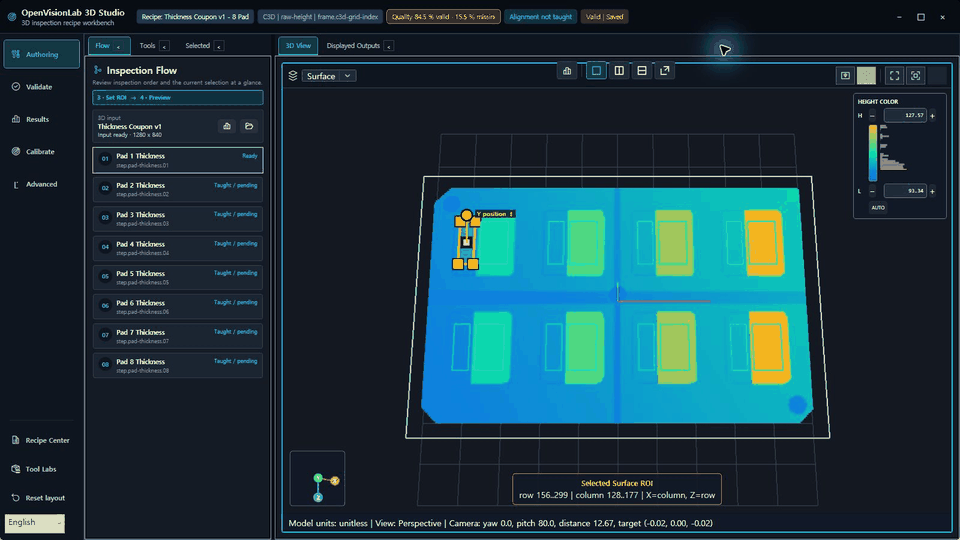
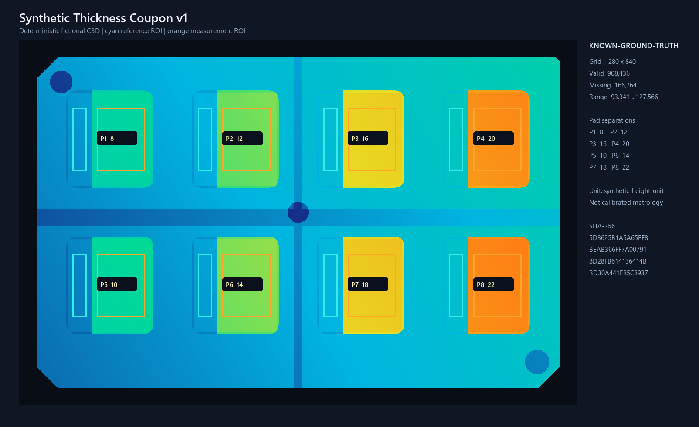

# OpenVisionLab 3D Studio

### 3D 데이터를 불러와 ROI를 가르치고, 검사 규칙을 저장·재현하는 Windows 검사 워크벤치

[](https://github.com/Noah8218/OpenVisionLab-3D-Studio/actions/workflows/ci.yml)


OpenVisionLab 3D Studio는 단순한 3D 파일 뷰어가 아닙니다. C3D 높이
데이터에서 기준 ROI와 측정 ROI를 지정하고, 검사 결과와 오버레이를
확인한 뒤 같은 검사 과정을 레시피로 다시 실행할 수 있게 만드는
규칙 기반 3D 검사 도구입니다.



> 현재 공개 개발 버전입니다. `raw-height` 또는
> `synthetic-height-unit` 값을 물리 단위로 교정한 mm 결과로 해석하면
> 안 됩니다.

## 주요 작업 흐름

```mermaid
flowchart LR
    Source["3D 파일 열기"] --> Quality["입력 품질 확인"]
    Quality --> Tool["검사 도구 추가"]
    Tool --> Reference["기준 ROI 지정"]
    Reference --> Measurement["측정 ROI 지정"]
    Measurement --> Parameter["파라미터 설정"]
    Parameter --> Preview["Preview"]
    Preview --> Review["결과·오버레이 검토"]
    Review --> Run["Run all"]
    Run --> Save["레시피 저장·다시 열기"]
```



- Surface와 전체 해상도 Height Image를 함께 보며 같은 ROI를 편집합니다.
- 기준/측정 ROI는 `Missing → Drawing → Review → Applied` 상태로 관리됩니다.
- Preview와 Run은 명시적으로 실행하며, 단순 보기나 선택은 검사를
  자동 실행하지 않습니다.
- 단계, 입력, 파라미터, ROI 역할, 출력 ID를 레시피에 저장하고 다시
  열 수 있습니다.
- 출력 Pin과 A/B/C 비교, 나란히/위아래/Pop-out Viewer를 지원합니다.

## 공개 합성 두께 샘플

회사·고객 데이터 없이 전체 두께 검사 흐름을 재현할 수 있도록
`Synthetic Thickness Coupon v1`을 제공합니다.



- 해상도: `1280 × 840`
- 구성: `4 × 2` 배열의 8개 독립 패드
- 정답 두께: `8, 12, 16, 20, 10, 14, 18, 22`
- 레시피: 8개 Thickness 단계와 16개 독립 ROI
- 재현: 생성 스크립트, C3D SHA-256, 정답 JSON, Runner 결과 포함

```powershell
python scripts/generate-synthetic-thickness-coupon.py `
  --output 3D/SyntheticValidation/ThicknessCouponV1
```

자세한 계약과 검증값은
[합성 샘플 마이그레이션 문서](docs/OPENVISIONLAB_3D_SYNTHETIC_THICKNESS_SAMPLE_MIGRATION_20260728.md)에서
확인할 수 있습니다.

## 현재 제공하는 기능

| 영역 | 기능 |
| --- | --- |
| 입력 | C3D, glTF/GLB, STL, LAS/LAZ |
| 3D Viewer | Surface 기본 표시, Points/Wireframe/Edges, Top/Perspective, Fit all/Fit ROI |
| Height Image | 원본 격자 전체 해상도, Fit/1:1/Zoom/Pan, 공유 hover, invalid-cell 표시 |
| ROI | 기준·측정 GridRectangle, Review/Apply/Cancel/Delete, 2D/3D 동기화 |
| 검사 구성 | Tool Catalog → Recipe Chain → Selected Tool → Viewer |
| 측정 | Thickness, Warpage, Plane Flatness, Point Pair, Gap/Flush, Volume 등 |
| 실행·증거 | 명시적 Preview/Run, 상태·메트릭·오버레이, Headless Runner |
| 저장 | 단계 순서, 입력, 파라미터, ROI 역할, 출력 ID 저장·복원 |

## 빠른 실행

필수 환경:

- Windows 10/11
- .NET 10 SDK
- OpenGL 호환 GPU/드라이버

```powershell
git clone https://github.com/Noah8218/OpenVisionLab-3D-Studio.git
cd OpenVisionLab-3D-Studio
dotnet build OpenVisionLab.ThreeDStudio.sln -c Debug -p:Platform="Any CPU"
dotnet run --no-build `
  --project src/OpenVisionLab.ThreeD.Shell/OpenVisionLab.ThreeD.Shell.csproj `
  -c Debug
```

앱이 열리면
`3D/SyntheticValidation/ThicknessCouponV1/inspection-recipe.ov3d-recipe.json`을
열어 8개 패드의 ROI와 두께 단계를 바로 확인할 수 있습니다.

## 단축키

| 단축키 | 동작 |
| --- | --- |
| `Ctrl+N` | 새 레시피 |
| `Ctrl+O` | 레시피 열기 |
| `Ctrl+Shift+O` | 3D 입력 열기 |
| `Ctrl+S` | 저장 |
| `Ctrl+Shift+S` | 다른 이름으로 저장 |
| `F5` | 선택 단계 Preview |
| `Ctrl+F5` | 전체 검사 실행 |
| `Enter` | ROI 후보 적용 |
| `Esc` | ROI 후보 취소 |
| `Delete` | 선택 ROI/단계의 지원되는 삭제 동작 |

## 범위와 한계

- 현재 목표는 로컬 파일 기반의 결정론적 2.5D/3D 검사 워크벤치입니다.
- 카메라 획득, PLC/로봇/필드버스, 클라우드, 생산라인 HMI는 현재 범위가
  아닙니다.
- 합성 샘플은 소프트웨어 계산과 재현성을 검증합니다. 물리 교정,
  측정 불확도, 생산 공차 적합성을 증명하지 않습니다.
- 저장소에는 명시적인 라이선스 파일이 아직 없습니다. 재배포 조건을
  확정하기 전에는 별도 확인이 필요합니다.

## 개발 문서

- [개발·검증 가이드](docs/OPENVISIONLAB_3D_DEVELOPMENT_AND_VERIFICATION_GUIDE.md)
- [제품 방향과 전체 백로그](docs/OPENVISIONLAB_3D_MASTER_DEVELOPMENT_WORKFLOW_AND_BACKLOG_20260727.md)
- [다음 세션 인수인계](docs/OPENVISIONLAB_3D_NEXT_SESSION_HANDOFF.md)
- [샘플 데이터 정책](docs/OPENVISIONLAB_3D_SAMPLE_DATA.md)
