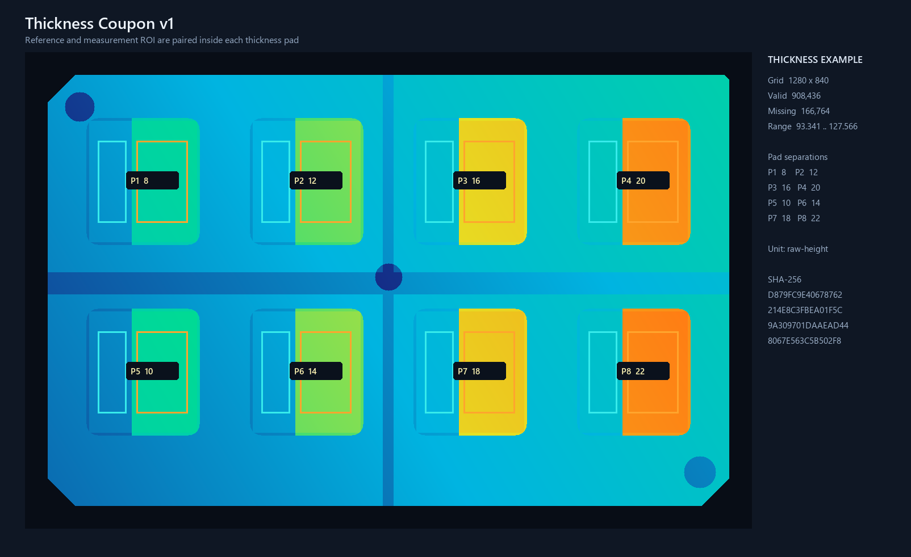

# OpenVisionLab 3D Studio

### Build, teach, validate, and replay rule-based 3D inspection recipes on Windows

[](https://github.com/Noah8218/OpenVisionLab-3D-Studio/actions/workflows/ci.yml)


OpenVisionLab 3D Studio is a local desktop workbench for repeatable, rule-based
3D inspection. An operator can load height, mesh, or point-cloud data; check
source quality; teach measurement regions; set explicit limits; preview the
selected step; run a complete recipe; and review the resulting metrics,
overlays, and records in one application.


## Version

Current version: `v0.5.1-dev`

This project is maintained using explicit version numbers.

### Recent version history

#### `v0.5.1-dev` (2026-09-05)

- Consolidates Shell workflow, dialog, persistence, and smoke lifetimes into
  explicit owners while preserving Preview, Publish, Run, Save, and Reopen.
- Extracts Viewer point-cloud loading, render-resource, cache, transform, and
  display-color ownership without changing the public Viewer contract.
- Keeps recipe, Run Record, integration, and raw-height unit semantics
  compatible; this refactor does not establish calibration or production
  metrology.

#### `v0.5.0-dev` (2026-09-04)

- Batches Shell and Viewer lifetime, cancellation, dispatcher, and resource
  ownership refactors behind explicit coordinators while keeping the public
  recipe and Preview/Publish/Run contracts.
- Adds a dedicated Verification project and an independent Viewer binary-host
  consumer path for DLL boundary and control-lifecycle checks.
- Preserves the V2 integration exchange, existing recipe/storage formats, and
  the software-only measurement boundary.

#### `v0.4.9-dev` (2026-09-01)

- Extracted Shell source-load operation lifetime into a WPF-neutral coordinator
  shared by C3D and Viewer-only imports, including latest-operation
  cancellation and stale Workbench-state suppression.
- Preserved public Viewer load methods, OpenGL application boundaries, recipe
  compatibility, and explicit Preview/Publish/Run behavior.

#### `v0.4.8-dev` (2026-09-01)

- Extracted cancellable C3D source decode and render-topology preparation from
  the WPF Viewer control into a WPF-neutral Loading owner.
- Preserved the public Viewer load contract, OpenGL apply boundary, recipe
  semantics, and explicit Preview/Publish/Run workflow.

#### `v0.4.7-dev` (2026-09-01)

- Extracted teaching-capture source identity validation and C3D ROI point
  preparation from the WPF Viewer control into a WPF-neutral owner.
- Preserved the public Viewer capture API, recipe/Selection contracts,
  OpenGL interaction, and explicit Preview/Publish/Run workflow.

#### `v0.4.6-dev` (2026-09-01)

- Extracted Surface Match evidence validation, coordinate mapping, and edge
  render-snapshot preparation from the Viewer control into a WPF-neutral owner.
- Preserved the public Viewer display contract, OpenGL drawing, ViewModel
  scene/camera state, and explicit recipe workflow semantics.

#### `v0.4.5-dev` (2026-09-01)

- Extracted Current Recipe Run Smoke preparation and post-capture ordered-run activation into a dedicated Shell verification owner.
- Preserved RunCurrentRecipeButton command validation, activation evidence, 30-second/50-ms wait behavior, and explicit recipe workflow semantics.

#### `v0.4.4-dev` (2026-09-01)

- Extracted Viewer workspace presentation/layout Smoke orchestration into a dedicated Shell verification owner.
- Preserved Viewer workspace state, layout precedence, camera-link evidence, and explicit workflow semantics.

#### `v0.3.1-dev` (2026-09-01)

- Expands the public documentation map with deterministic 3D integration,
  verification, and workflow evidence.
- Adds repository operating guidance and traceability records for the current
  development baseline.
- Keeps the development line software-only and does not claim physical
  calibration or production metrology.

#### `v0.3.0-dev` (2026-08-29)

- Adds deterministic propagation of a selected connected region through a
  published affine transform into a separate immutable result artifact.
- Preserves exact region membership and missing-cell semantics with JSON
  round-trip identity and fail-closed source/frame/unit guards.
- Keeps re-grid, calibration, and physical-metrology claims outside this
  software-only development scope.

#### `v0.2.0-dev` (2026-08-28)

- Adds deterministic 3D integration, connected-region analysis, height-image
  alignment, and rigid-pose preparation workflows.
- Adds bounded background preparation for height fields and identified point
  clouds, with explicit derived-output identity and replay evidence.
- Keeps the current development line software-only and does not claim physical
  calibration or production metrology.

## Start here

Choose the path that matches what you have:

- **Self-contained Windows package:** extract the folder, run
  `OpenVisionLab.ThreeD.Shell.exe`, and follow the package `README.md`. The
  package includes its .NET runtime; no developer utilities are required.
- **GitHub source clone:** install the source-build prerequisites, clone this
  repository, build it, and launch the Shell using the commands below.

For a guided first inspection, see the
[user tutorial](docs/OPENVISIONLAB_3D_USER_TUTORIAL.md).

## What the operator workflow looks like

```mermaid
flowchart LR
    Source["Open 3D data"] --> Quality["Review source quality"]
    Quality --> Tool["Add or select an inspection step"]
    Tool --> Teach["Teach ROI and parameters"]
    Teach --> Preview["Preview selected step"]
    Preview --> Publish["Publish accepted preview"]
    Publish --> Run["Run complete recipe"]
    Run --> Evidence["Review metrics, overlays, and records"]
    Evidence --> Save["Save and reopen the recipe"]
```



Preview, Publish, Run, and validation are explicit actions. Editing a
parameter, changing Viewer visibility, or reopening saved setup does not run an
inspection automatically.

Source Quality also provides one explicit acquisition/source contract editor.
Record whether acquisition evidence is available, the evidence and known
limitations, and—when supplied—the source-frame `Sensor → scene` XYZ direction.
Then choose **Apply source contract**. The normalized direction can classify
existing edge normals for display, but it does not change matching or infer a
camera pose, calibration, or viewpoint from geometry.

## Included Thickness Coupon tutorial data

The repository and the self-contained package include a ready-to-run Thickness
Coupon with eight independently inspectable pads.



| Item | Included value |
| --- | --- |
| Height grid | 1280 × 840 |
| Layout | Eight pads in a 4 × 2 arrangement |
| Recipe | Eight Thickness steps with 16 editable ROIs |
| ROI contract | Reference and Measurement ROI remain on the same visible pad |
| Declared unit | `raw-height` |

Open this recipe from **Recipe Center → Open existing recipe**:

```text
3D\Samples\ThicknessCouponV1\inspection-recipe.ov3d-recipe.json
```

The recipe keeps its C3D input beside the recipe file, so the complete example
works after cloning or moving the whole package folder.

## Supported inspection work

| Area | Current workflow |
| --- | --- |
| Input review | C3D recipe-source loading plus Viewer-only GLB, STL, LAS, and LAZ import, with progress/cancel, visible limitations, source-quality evidence, and optional source-frame sensor-to-scene direction |
| Preparation | Median filtering, outlier removal, surface leveling, and explicit ROI/Crop into a separate immutable HeightField; compatible later tools can teach against the Published crop |
| Height inspection | Thickness, Warpage, Plane Flatness, Height Deviation, Gap/Flush, Volume, and grid/region statistics |
| Geometry inspection | Point-pair and cross-section measurements, lines, planes, edges, landmarks, nominal/actual mesh comparison, and deterministic surface matching |
| Teaching | Linked 3D and full-resolution Height Image editing for GridRectangle, GridCircle, and ordered GridPolygon selections with explicit Review, Apply, Cancel, and Delete actions; GridPolygon stores an authoring outline only and does not create a mask, region artifact, or downstream inspection input |
| Validation | Good, Bad, and Held-out sample roles; run results; failure analysis; threshold review; and held-out replay |
| Evidence | Viewer overlays, metrics, reports, output comparison, retained match review, headless Runner records, and a privacy-safe support ZIP |
| Recipe lifecycle | Save and restore ordered steps, inputs, parameters, ROI roles, outputs, and validation setup |

Measurements use the unit declared by the source. A `raw-height` result is not
automatically a calibrated physical measurement. Apply and verify the correct
calibration and acceptance limits before using physical tolerances.

Use the import button in the 3D Viewer toolbar for supported local 3D data.
`C3D` becomes the recipe input; `GLB`, `STL`, `LAS`, and `LAZ` are displayed in
the Viewer only and leave the recipe input unchanged. The application does not
advertise `.gltf`, OBJ, PCD, XYZ, TIFF, or RAW as general import formats.

When support evidence must be shared, open **Results → Run Record** and choose
**Export privacy-safe support bundle**. The ZIP includes a manifest, sanitized
recipe, the newest 200 session-log entries at most, source identity, recorded
Source Quality, and the current result. It omits raw 3D source or mesh bytes,
absolute paths, the full application log, and user or machine identity by
default. Review the ZIP before sending it. The separate full Run Record export
is not the privacy-safe sharing path.

## Build and run from a fresh clone

### Prerequisites

- Windows 10 build 19041 or later, or Windows 11, on x64
- OpenGL-compatible GPU with a current vendor driver
- Git
- Windows PowerShell 5.1 or later
- .NET 10 SDK `10.0.300` or later in the .NET 10 line

Python 3.13 is required only for the repository's full independent verification
suite, not for a normal source build or application launch.

Check the current machine without changing it:

```powershell
powershell -NoProfile -ExecutionPolicy Bypass -File scripts\setup-development-environment.ps1 -CheckOnly -Scope Build
```

Install only missing build utilities by their fixed `winget` package IDs:

```powershell
powershell -NoProfile -ExecutionPolicy Bypass -File scripts\setup-development-environment.ps1 -InstallMissing -Scope Build
```

Clone to a short local path to avoid Windows and NuGet path-length failures:

```powershell
cd C:\src
git clone https://github.com/Noah8218/OpenVisionLab-3D-Studio.git
cd OpenVisionLab-3D-Studio
dotnet restore OpenVisionLab.ThreeDStudio.sln
dotnet build OpenVisionLab.ThreeDStudio.sln -c Release -p:Platform="Any CPU"
dotnet test --project tests\OpenVisionLab.ThreeD.Data.Tests\OpenVisionLab.ThreeD.Data.Tests.csproj -c Release --no-build --no-restore --minimum-expected-tests 2
dotnet run --no-build --project src\OpenVisionLab.ThreeD.Shell\OpenVisionLab.ThreeD.Shell.csproj -c Release
```

The repository contains the vendored `OpenVisionLab.Vision3D` and WPF
PropertyGrid packages required by the solution. A separate
`OpenVisionLab-Vision-SDK` checkout is not required to build or run this
project.

See [system requirements and setup](docs/OPENVISIONLAB_3D_SYSTEM_REQUIREMENTS_AND_SETUP.md)
for full verification utilities, exact package IDs, short NuGet-cache guidance,
and post-reinstall recovery.

## Create the self-contained Windows package

From a source clone:

```powershell
powershell -NoProfile -ExecutionPolicy Bypass -File scripts\publish-windows-app.ps1
```

The default output is
`artifacts\release\openvisionlab-3d-studio-win-x64`. It is a folder-based,
self-contained `win-x64` package with the application, samples, recipes,
operator documentation, license notices, and a SHA-256 manifest.

The package quick-start source is available at
[Windows package quick start](docs/OPENVISIONLAB_3D_WINDOWS_PACKAGE_QUICK_START.md).

## Keyboard shortcuts

| Shortcut | Action |
| --- | --- |
| `Ctrl+N` | New recipe |
| `Ctrl+O` | Open recipe |
| `Ctrl+Shift+O` | Open C3D height input |
| `Ctrl+S` | Save recipe |
| `Ctrl+Shift+S` | Save recipe as |
| `F5` | Preview the selected step |
| `Ctrl+F5` | Run the complete recipe |
| `Enter` | Apply the current ROI candidate |
| `Esc` | Cancel the current ROI candidate |
| `Delete` | Delete the selected supported ROI or recipe item |

## Documentation

- [Documentation map](docs/README.md)
- [User tutorial](docs/OPENVISIONLAB_3D_USER_TUTORIAL.md)
- [System requirements and setup](docs/OPENVISIONLAB_3D_SYSTEM_REQUIREMENTS_AND_SETUP.md)
- [Windows package quick start](docs/OPENVISIONLAB_3D_WINDOWS_PACKAGE_QUICK_START.md)
- [Sample data](docs/OPENVISIONLAB_3D_SAMPLE_DATA.md)
- [Changelog](CHANGELOG.md)
- [Sample data and attribution](3D/PublicSamples/README.md)

## License and attribution

OpenVisionLab 3D Studio is licensed under the
[Apache License 2.0](LICENSE). Commercial use, modification, and redistribution
are permitted under its terms. Distributions must retain the `LICENSE`,
`NOTICE`, copyright, and required attribution notices. Third-party components
remain subject to their respective licenses.

```text
This project includes software developed by Noah Choi.
Copyright (c) 2026 Noah Choi.
```
