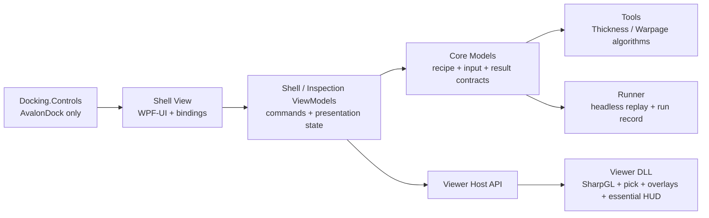

# OpenVisionLab 3D Thickness / Warpage UI Concept

Updated: 2026-07-18
Status: **specialized Thickness/Warpage and Calibration reference; no longer the default product-entry architecture**

> The 2026-07-18 approved default is the composable Tool Recipe Workbench in `OPENVISIONLAB_3D_TOOL_RECIPE_WORKBENCH_REFACTOR_PLAN_20260718.md`. This document remains the reference for specialized Thickness, Warpage, and Calibration screens; it must not be read as limiting the product to those two measurements.

Calibration Center and the final application theme are specified in the Korean companion proposal:
`OPENVISIONLAB_3D_CALIBRATION_AND_THEME_UI_CONCEPT_20260717.md`.

## 1. Purpose

This document proposes the first inspection-oriented UI for OpenVisionLab 3D Studio.
The initial workspaces are:

1. **Thickness Inspection**
2. **Warpage Inspection** (the user's "warpage/warp" target; Korean: warpage, bend, deformation)
3. **Calibration Center** (height calibration, sensor alignment, repeatability, profile validation)

The proposal reuses the local WPF stack already proven in both repositories:

- `WPF-UI 4.3.0` for the application theme, standard controls, icons, and command chrome;
- `Dirkster.AvalonDock 4.74.1` for resizable, dockable work areas;
- the separate `OpenVisionLab.ThreeD.Viewer` DLL for the SharpGL viewport and essential Viewer interactions;
- strict **View -> ViewModel -> Model** implementation order.

The owner accepted the captured Phase A layout on 2026-07-17. The Calibration Center has a Phase B ViewModel baseline and a Phase C offline Thickness Repeatability Model that passes `34/34` independent analytic/error cases. The product UI still has no real study input or calculated values; physical calibration and metrology claims remain unauthorized.

## 2. Product Decision

### Selected concept: Inspection-first Docked Workbench

The first screen is the actual inspection workbench, not a landing page and not a generic model-viewer demo.

The operator should always be able to answer six questions without opening another window:

1. What source and reference are being inspected?
2. Which coordinate frame, unit, and calibration state are active?
3. Which inspection step is selected and how is it configured?
4. What does the result mean spatially in the 3D data?
5. Is the current result a stale preview, a current preview, or a published result?
6. Which calibration profile produced the physical unit/frame, and is that profile currently valid?

### Why this concept

Commercial products consistently treat the 3D view as the center of a traceable workflow rather than a passive renderer:

- ZEISS INSPECT keeps nominal/actual data, inspection elements, editable parameters, color scales, labels, and reports in one repeatable project workflow.
- PolyWorks|Inspector combines ordered inspection operations, control views, color-map deviation analysis, and reporting.
- GoPxL emphasizes resizable panels, searchable tools, split data views, per-view palettes, and immediate measurement-result review.
- Geomagic Control X separates project authoring from a review-oriented Inspection Viewer while preserving full 3D navigation and report customization.

OpenVisionLab should adopt those workflow patterns without copying vendor visuals or expanding into their full CAD, sensor, automation, or enterprise scope.

## 3. Local Reference Findings

### `C:\Git\OpenVisionLab_Dev`

The 2D reference repository already establishes these reusable decisions:

| Local reference | Decision to retain |
| --- | --- |
| `OpenVisionLab.csproj` | Owns `WPF-UI 4.3.0` at the application level. |
| `0. UI/Wpf/OpenVisionLabWpfTheme.xaml` | Loads the WPF-UI theme and control dictionaries once. |
| `Library/OpenVisionLab.Docking.Controls` | Owns `Dirkster.AvalonDock`; the main application does not take a direct AvalonDock dependency. |
| `OpenVisionLayerDockWorkspaceView.xaml` | Keeps native docking details inside a dedicated docking View. |
| Tool workflow | Explicit Preview/Run, output separation, tool parameters, result comparison, and repeatable evidence remain visible product contracts. |

The Dev worktree was inspected read-only and was not modified.

### Current 3D repository

The 3D repository already uses the same package versions and has the correct high-level zones:

- left `Data & Layers`;
- center `3D Inspection View`;
- right `Tool / Inspector`;
- bottom `Evidence Workbench`;
- separate bottom `Linked View`.

The main structural problem is not missing panels. It is that too many details are permanently expanded and the two bottom panes reduce the 3D viewport. The next UI should consolidate and prioritize rather than add another panel.

## 4. Proposed Default Layout

```text
+------------------------------------------------------------------------------------------+
| WPF-UI Title / Job Bar                                                                  |
| [Project] [Open] [Save] | Setup  Inspect  Calibrate  Review | Preview | Publish | Run  |
+----------------------+------------------------------------------------+------------------+
| Project Explorer     | 3D Inspection Document                         | Tool Inspector   |
| 260 px               | minimum 55% of client area                     | 340 px           |
|                      |                                                |                  |
| Job                  | [Select] [Orbit] [Pan] [Fit] [View] [Color]    | Thickness        |
|  Inputs              |                                                | or Warpage       |
|  References          |              SharpGL viewport                  |                  |
|  ROIs                |                                                | Method           |
|  Inspection Steps   | axis triad              color/tolerance legend | Reference        |
|  Results             | selected point          result status          | ROI              |
|                      |                                                | Tolerance        |
| visibility / state   | unit / frame / calibration / sample density    | Metrics          |
+----------------------+------------------------------------------------+------------------+
| Analysis & Evidence Dock - one tabbed area, default 220 px                               |
| Results | Height Map | Profile | Distribution | Point Details | Run Evidence              |
+------------------------------------------------------------------------------------------+
| Status Bar: source | unit | frame | calibration | points | display stride | FPS | cursor |
+------------------------------------------------------------------------------------------+
```

### Layout rules

1. The center Viewer is a non-closable AvalonDock document and remains the dominant surface.
2. Explorer, Inspector, and Analysis docks are resizable and may auto-hide.
3. `View > Reset Layout` restores a known default.
4. The two existing bottom panes become one tabbed **Analysis & Evidence** dock.
5. Thickness and Warpage use the same layout. Selecting a step changes the Inspector and default analysis tab; it does not reconstruct the entire window.
6. A layout change, visibility toggle, camera change, color-map change, or render-density change never runs Preview.
7. At `1280 x 760`, no control may overlap and the Viewer must remain usable. The primary design target is `1600 x 900`.

## 5. Top-Level Interaction Model

### Job bar

The job bar contains only global or explicit execution commands:

| Group | Commands |
| --- | --- |
| File | New/Open Project, Open Data, Save Recipe |
| Workflow mode | Setup, Inspect, Calibrate, Review segmented control |
| Execution | Preview, Cancel, Publish, Run/Compare |
| Layout | Reset Layout, pane visibility menu |
| State | Dirty, Not Run, Stale, Preview Ready, Published, Pass/Fail |

Use WPF-UI icons for familiar actions and text only where the command meaning must be explicit (`Preview`, `Publish`, `Run`). Icon-only buttons require tooltips and automation names.

### Project Explorer

The left tree is the source of truth for project contents:

```text
Inspection Job
  Inputs
    Actual / Top Surface
    Bottom or Reference Surface
    Nominal Surface (optional, later phase)
  References
    Coordinate Frame
    Datum / Reference Plane
  ROIs
    Inspection ROI
    Reference ROI
    Exclusion ROI
  Inspection Steps
    Thickness 01
    Warpage 01
  Results
    Preview result
    Published result
```

Selecting a node updates the right Inspector. Eye toggles change rendering only. Source, preview, and published result identities remain separate.

### 3D Inspection Document

The Viewer must always include these essential facts because the DLL is also used outside the full Shell:

- orbit, pan, zoom, fit, reset, selection, and measurement modes;
- axis triad and active coordinate frame;
- unit and calibration state;
- active source/result identity;
- color/tolerance legend;
- selected-point coordinates and result value;
- current Preview/Published/Stale state;
- concise metrics for the active result.

The Shell Inspector may expose more editing detail, but it must not be required to understand the rendered result.

### Tool Inspector

The right pane is selection-driven. It does not permanently stack every available tool.

Common sections:

1. Identity and status
2. Input and reference
3. Method and direction
4. ROI
5. Tolerance
6. Advanced parameters (collapsed by default)
7. Current metrics
8. Sticky action footer: Preview / Cancel / Publish

### Analysis & Evidence dock

| Tab | Purpose |
| --- | --- |
| Results | Pass/Fail, primary metrics, limits, coverage, extrema |
| Height Map | Linked 2D map with the same ROI, selection, and color scale |
| Profile | X/Y or user-selected section profile with tolerance bands |
| Distribution | Histogram and below/within/above counts |
| Point Details | Selected source index/cell, coordinates, value, provenance, status |
| Run Evidence | Recipe/source fingerprints, Viewer/Runner parity, screenshot and report paths |

The result must remain understandable in the Viewer. These tabs provide deeper analysis, not hidden mandatory facts.

## 6. Thickness Inspection Workspace

### Meaning boundary

The UI must not label every Z distance as physical thickness.

Initial methods are explicitly separated:

| Method | Meaning | Initial availability |
| --- | --- | --- |
| Surface Pair | Distance between aligned top and bottom surfaces in a declared direction. | Primary target when two valid surfaces exist. |
| Surface to Reference Plane | Signed height/depth from one surface to a plane. | Supported as relative thickness/height; not wall thickness. |
| Mesh Wall Thickness | Opposite-surface search along normal/ray with opening-angle controls. | Later algorithm phase. |
| Actual vs Nominal Thickness | Thickness deviation from a nominal/CAD definition. | Later nominal-comparison phase. |

The current C3D sample has unverified physical scale. Its results must display `raw-height` or `model` units until independent calibration metadata exists.

### Inspector structure

```text
Thickness 01                                      [Enabled]
State: Ready / Stale / Preview Ready / Published

Input
  Top surface           [entity selector]
  Bottom/reference      [entity selector]
  Unit / frame          [read-only trust state]

Method
  [Surface Pair v]
  Direction             [Frame Z | Surface normal | Custom vector]
  ROI                   [Select / Edit / Clear]

Limits
  Lower limit           [value + unit]
  Upper limit           [value + unit]
  No-match handling     [Fail | Exclude with coverage gate]

Advanced
  Maximum search distance
  Maximum normal angle
  Minimum valid coverage

Current result
  Min | Max | Mean | Range | StdDev
  Below | Within | Above | No match | Coverage

                       [Preview] [Cancel] [Publish]
```

### Viewer/result contract

- Thickness uses a sequential map for raw values and a tolerance/status map for acceptance review.
- The legend always shows numeric minimum, lower limit, nominal/center when defined, upper limit, maximum, and unit.
- Minimum and maximum locations may be pinned as labels.
- Selecting a point links the 3D position, height-map cell, profile cursor, thickness value, and status.
- Invalid/no-match points have a distinct visual state and are never silently removed from coverage metrics.
- Color is never the only Pass/Fail channel; status text and counts remain visible.

### Default linked view

`Height Map` is the default bottom tab after Preview. `Profile` opens when a section line is selected.

## 7. Warpage Inspection Workspace

### Meaning boundary

The first Warpage tool measures signed surface deformation relative to an explicit reference. It is not marketed as certified GD&T flatness and it does not perform ZEISS-style virtual clamping.

The current local C3D file named Warpage is not authorized as this input: its
C3D and PNG bytes are identical to the Thickness candidate and no independent
source meaning or reference contract exists. Preserve this design as a future
target, not an implementation instruction, until the intake in
`docs/OPENVISIONLAB_3D_WARPAGE_INPUT_PREFLIGHT_20260717.md` is satisfied.

Initial reference modes:

| Reference mode | Meaning | Initial availability |
| --- | --- | --- |
| Datum / Reference ROI plane | Fit or define a plane from a separate trusted region. | Primary target. |
| Best-fit plane in inspection ROI | Least-squares reference over the measured region. | Primary target with fit residual evidence. |
| Three-point datum plane | Plane from three selected points/features. | Next small extension. |
| Nominal surface | Signed deviation from an aligned nominal surface. | Later nominal-comparison phase. |
| Virtual clamping / de-warp | Simulated fixture or force compensation. | Explicitly out of current scope. |

### Inspector structure

```text
Warpage 01                                        [Enabled]
State: Ready / Stale / Preview Ready / Published

Input
  Actual surface        [entity selector]
  Unit / frame          [read-only trust state]

Reference
  [Datum ROI Plane v]
  Reference ROI         [Select / Edit / Clear]
  Inspection ROI        [Select / Edit / Clear]
  Direction             [Plane normal | Frame Z]

Limits
  Maximum total warpage [peak-to-valley]
  Positive limit        [optional]
  Negative limit        [optional]
  Minimum valid coverage

Current result
  Peak-to-valley | Max positive | Max negative | RMS
  Reference residual | Valid count | Coverage | Status

                       [Preview] [Cancel] [Publish]
```

### Viewer/result contract

- Warpage uses a diverging map centered at zero.
- The reference plane and its normal can be toggled independently.
- Positive and negative extrema remain visible with numeric labels.
- The profile view shows the zero reference and tolerance bands.
- A changed ROI, reference, direction, filter, or tolerance marks the Preview stale.
- Camera, visibility, geometry style, palette, and display density do not invalidate measurement results.

### Default linked view

`Profile` is the default bottom tab after Preview. `Distribution` is the secondary default for reviewing signed deformation.

## 8. Shared Workflow States

| State | Meaning | Allowed primary action |
| --- | --- | --- |
| `NoInput` | Required source is missing. | Open data |
| `ReferenceRequired` | Source exists but the selected method lacks a valid reference. | Define/select reference |
| `Ready` | Inputs, unit/frame, ROI, method, and limits are valid. | Preview |
| `PreviewRunning` | Explicit calculation is in progress. | Cancel |
| `PreviewReady` | Complete result matches the current input/parameter fingerprint. | Publish or Preview again |
| `PreviewStale` | A result-affecting setting changed after Preview. | Preview |
| `Published` | The current Preview was explicitly published as a separate result. | Save/Run/Compare |
| `Failed` | Validation or execution failed without a complete result. | Correct input or Preview again |

Preview completion is atomic. Cancellation or failure must not leave a partial map labelled as ready.

## 9. Workspace Presets

The UI uses one component tree with two presets, not two separate windows.

| Preset | Selected step | Default map | Default analysis tab | Key overlay |
| --- | --- | --- | --- | --- |
| Thickness | Thickness step | Thickness/tolerance | Height Map | Min/max and no-match locations |
| Warpage | Warpage step | Signed deviation | Profile | Reference plane and positive/negative extrema |
| Calibration | Calibration profile/study | Residual or repeatability map | Values + Run Chart | Profile validity and residual evidence |

The user can rearrange panes. The application stores the docking layout separately from recipe data so a personal layout never changes inspection logic.

## 10. MVVM And Project Ownership

### Required implementation order

Implementation after approval must proceed in this order and keep every checkpoint buildable:

1. **View**
   - Restructure the Shell XAML into the proposed zones.
   - Apply WPF-UI resources and icon controls.
   - Consolidate the bottom docks.
   - Use existing state where possible; new inspection controls remain non-operational until their ViewModel checkpoint.
   - Capture fresh `1600 x 900` and `1280 x 760` screenshots.
2. **ViewModel**
   - Add selection, workspace mode, pane state, explicit commands, validation presentation, and stale/current state.
   - Commands and state do not live in View code-behind.
   - Behaviors handle reusable UI interaction; converters only transform View presentation values.
3. **Model**
   - Add typed Thickness and Warpage recipe/input/result/tolerance contracts.
   - Implement algorithms in Tools and replay in Runner only after the visible workflow is accepted.
   - Preserve Viewer/Runner metric and status parity.

### Project boundaries



| Project | Owns | Must not own |
| --- | --- | --- |
| `OpenVisionLab.ThreeD.Shell` | Main View, WPF-UI theme, Shell ViewModels, workspace orchestration | Geometry algorithms |
| `OpenVisionLab.ThreeD.Docking.Controls` | AvalonDock View and layout persistence bridge | Inspection business state |
| `OpenVisionLab.ThreeD.Viewer` | Rendering, pointer bridge, camera, pick, overlays, essential viewer presentation, Host API | Full recipe/run-history workflow |
| `OpenVisionLab.ThreeD.Core` | Typed immutable/shared contracts | WPF controls |
| `OpenVisionLab.ThreeD.Tools` | Render-independent calculation | Shell or Viewer controls |
| `OpenVisionLab.ThreeD.Runner` | Headless replay and durable evidence | WPF dependencies |

## 11. Visual Direction

- Use a neutral light WPF-UI application chrome with a dark inspection viewport.
- Reserve scientific color maps for measured data; do not color the entire application with one hue family.
- Use flat toolbars, splitters, trees, tabs, and property rows rather than nested cards.
- Use status colors consistently: neutral/not-run, blue/running, amber/stale, green/pass, red/fail, gray/unavailable.
- Keep text labels compact in panels; large display typography is not appropriate inside the workbench.
- Fixed icon-button dimensions prevent layout movement when state changes.
- Use `4 px` or smaller corner radii unless a WPF-UI standard control requires otherwise.
- All critical status must have text or numeric evidence in addition to color.

## 12. Proposed Implementation Slices After Approval

### Slice 1 - View-only workbench shell

- WPF-UI job bar and status bar;
- AvalonDock center document, Explorer, Inspector, and consolidated bottom dock;
- Thickness/Warpage step selection surface;
- no new algorithm and no altered Preview behavior;
- screenshot and current regression evidence.

### Slice 2 - ViewModel workflow state

- active inspection step and workspace preset;
- command enablement and explicit Preview/Publish state;
- pane selection and result-tab routing;
- no typed algorithm model yet beyond existing contracts.

### Slice 3 - Thickness typed vertical slice

- choose one physically honest first method after source-data review;
- typed recipe/result contract;
- Viewer map, linked height map/profile, metrics, tolerance, Publish;
- Runner parity and controlled error cases.

### Slice 4 - Warpage typed vertical slice

- datum-ROI or best-fit reference plane;
- signed map, profile, extrema, peak-to-valley, RMS, coverage;
- typed recipe/result contract, Publish, Runner parity, and controlled errors.

## 13. UI Acceptance Checklist

- [ ] The Viewer occupies at least 55% of the default usable client area.
- [ ] One selected step controls one Inspector; tools are not permanently stacked.
- [ ] Thickness and Warpage share one stable workbench layout.
- [ ] Explorer distinguishes inputs, references, ROIs, steps, preview, and published results.
- [ ] Unit, frame, and calibration state are visible in both Shell and essential Viewer HUD.
- [ ] Preview, Cancel, Publish, and Run states are unambiguous.
- [ ] Render-only changes never run or invalidate inspection calculations.
- [ ] Result-affecting changes mark Preview stale without mutating Published evidence.
- [ ] The bottom analysis tabs link selection and color scale to the 3D view.
- [x] At `1600 x 900` and `1280 x 760`, the current Calibration Center layout does not clip or overlap its primary work areas.
- [ ] Keyboard focus, tooltips, and automation names exist for icon commands.
- [ ] Standalone Viewer remains useful without Shell-only inspection panes.
- [x] View contains no business logic; Calibration commands are ViewModel-owned; converters are presentation-only.
- [x] The current Viewer fixed matrix, BinaryHost gate, and Shell screenshot gate remain green for the Calibration ViewModel checkpoint.

## 14. Explicitly Out Of Scope

- live camera/sensor setup;
- PLC, robot, fieldbus, production HMI, or cloud integration;
- full CAD authoring and broad GD&T;
- certified metrology claims before physical calibration and uncertainty evidence;
- virtual clamping/de-warp simulation;
- batch SPC and enterprise quality databases;
- AI defect training;
- a ribbon containing every future command.

## 15. Commercial Sources Reviewed

Official vendor sources were checked on 2026-07-16.

1. [ZEISS INSPECT overview](https://www.zeiss.com/metrology/en/software/zeiss-inspect.html) - guided end-to-end workflow, parametric inspection steps, nominal/actual color scales, and reporting.
2. [ZEISS material thickness workflow](https://www.zeiss.com/metrology/us/explore/topics/calculate-material-thickness-in-zeiss-inspect.html) - 3D selection, thickness parameters, normal/opening-angle constraints, color legend, extrema labels, editable Explorer elements, and actual/nominal comparison.
3. [ZEISS De-Warp](https://www.zeiss.com/metrology/us/software/zeiss-inspect/de-warp.html) - unclamped/clamped comparison and virtual compensation; reviewed specifically to define what remains out of scope.
4. [PolyWorks|Inspector](https://www.innovmetric.com/products/polyworks-inspector) - ordered inspection sequences, control views, and surface/boundary/cross-section/thickness deviation color maps.
5. [LMI GoPxL modern UI](https://lmi3d.com/gopxl-modern-user-interface/) - resizable panels, searchable tools, up to four split viewers, per-view palettes, drag/reorder tool workflow, and embedded help.
6. [LMI GoPxL multidimensional measurement](https://lmi3d.com/gopxl-multi-dimensional-measurement-capability/) - combined 3D/2D data and multilayer thickness use cases.
7. [Geomagic Control X 2020 official overview](https://www.3dsystems.com/sites/default/files/2019-11/FLYER-Control-X-2020-WhatsNew-English-a4-web-2019-10-31.pdf) - separate Inspection Viewer, full 3D review controls, and report customization.

## 16. Approval Decision

Recommended approval target:

```text
One WPF-UI Shell
  + AvalonDock Explorer / Viewer Document / Inspector / Analysis tabs
  + shared Thickness and Warpage workspace presets
  + self-contained Viewer essentials
  + explicit Preview -> Publish -> Runner evidence
```

The owner accepted Slice 1, and the Calibration Center ViewModel plus offline Repeatability Model checkpoints pass. Continue with **explicit real-input loading and ViewModel result binding**; keep Calculate disabled and the UI empty until a valid study is loaded, and do not use synthetic golden values as product data.
