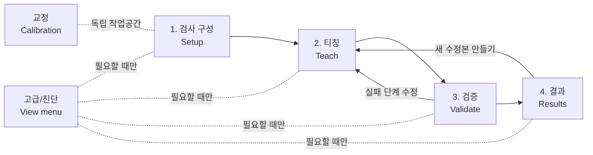

# OpenVisionLab 3D Workspace Information Architecture Redesign

Date: 2026-07-29

Status: Complete for design; IA-1 through IA-3 implemented

## Decision

The current all-in-one Inspection Workbench is no longer the target default
layout.

The new default information architecture is:

```text
Inspection Setup -> Teach -> Validate -> Results
```

The four stages are top-level workspaces, not four names that project the same
docked surface. Each workspace owns one operator goal and shows only the
controls, data, and evidence required for that goal.

- `Setup` owns source definition and recipe/tool composition.
- `Teach` owns the teaching source, selected step, regions, parameters,
  explicit Preview, and the selected step's detection overlay.
- `Validate` owns Good/Bad/Held-out samples, explicit Validation Set execution,
  failure navigation, distributions, and threshold review.
- `Results` owns read-only Run Records, output comparison, reports, and export.
- `Calibration` remains a separate top-level workspace.
- `Advanced / Diagnostics` remains opt-in under `View`; it is not a default
  operator stage.

This is an information-architecture correction, not a visual restyle. Existing
recipe, selection, Viewer, ROI, PropertyGrid, execution, Validation Set, and
Runner contracts remain the behavioral foundation.

## Why redesign is required

### Current visual evidence

The current Release-equivalent Wide and Compact captures are:

- `artifacts/current/20260729-completeness-threshold-assistance/after-completeness-threshold-wide.png`;
- `artifacts/current/20260729-completeness-threshold-assistance/after-completeness-threshold-compact.png`.

They show these responsibilities at the same time:

1. Tool Catalog;
2. Recipe Chain;
3. Selected Tool regions and parameters;
4. 3D Viewer and linked image commands;
5. Pipeline, problems, run history, Validation Set, threshold candidates, and
   error evidence.

The bottom validation surface can occupy approximately half of the application
while the tool catalog, recipe chain, selected tool, and Viewer remain present.
At Compact width, tabbing the first two panes reduces width pressure but does
not remove responsibility competition.

### Current source evidence

The issue is structural:

- `ShellWorkspaceMode` still declares `Workbench`, `Teach`, `Inspect`, and
  `Review`;
- `ShellMainWindowViewModel.IsWorkbenchWorkspaceSelected` returns `true` for
  all four modes;
- `ShellMainWindowViewModel.IsTaskWorkspaceSelected` always returns `false`;
- therefore `Teach`, `Inspect`, and `Review` all display the same
  `ToolRecipeWorkbenchView`;
- `ToolRecipeWorkbenchView` composes Tool Library, Recipe Chain, Selected Tool,
  Viewer, and the bottom Pipeline/Validation surface in one dock host;
- `RecipePipelineReviewView.xaml` is currently a 1,429-line view that combines
  several different operator jobs.

The old stage names are therefore state labels, not real information
boundaries.

### Reopened prior acceptance

Backlog item `A-01` was previously complete against the old requirement:

```text
Catalog -> Recipe Chain -> Selected Tool -> dominant Viewer
```

The owner has now explicitly rejected that composition as the default because
tool composition, teaching, validation, and result evidence do not need to be
visible together. `A-01` is reopened as `Partial`. Its existing behavior and
tests remain reusable regression evidence, but its default-layout acceptance
criterion is no longer current.

Inspection Workspace v3 remains `7/8` for its historical bounded workflow
until source implementation changes. The remaining owner replay must be
replaced with a new stage-navigation replay after this redesign is
implemented; the historical click path cannot close the redesigned workspace.

## Product grounding

This design preserves the current product identity:

> A local, file-first, deterministic 2.5D/3D rule-based inspection workbench
> for identified height fields, point clouds, and meshes.

It follows these OpenVisionLab requirements:

- Make the inspection chain understandable, keep one selected-tool
  editing surface, and let the visual teaching surface dominate when teaching;
- Separate configuration, teaching/execution, and
  visible per-region results;
- Separate model/data preparation from matching result diagnosis;
- Expose source quality and visual feedback in the task
  where they are needed instead of turning the whole product into a permanent
  device dashboard.

Camera acquisition, stereo reconstruction, PLC, fieldbus, robot, HMI, cloud,
plant management, and physical metrology claims remain outside this redesign.

## Navigation model



The persistent top navigation is:

```text
[OpenVisionLab]  검사 구성 | 티칭 | 검증 | 결과 | 교정
                                    Recipe name · Saved/Dirty   [Save] [View] [⋯]
```

Rules:

- the five stage labels are always in the same order;
- only one stage is active;
- `Advanced Layout`, Tool Labs, diagnostics, language, and secondary actions
  move into `View` or the overflow menu;
- the persistent header is limited to product identity, active recipe state,
  Save, navigation, and window controls;
- selected-step status and primary task actions belong to the active page
  header, not the global title bar;
- no second permanent journey strip is added.

## Screen contracts

### 1. 검사 구성 / Setup

Operator question:

> 어떤 입력을 받아 어떤 검사 도구 순서로 레시피를 구성하는가?

Visible:

- expected input/source slot and current binding summary;
- Tool Library with search, compatible/all filters, and Add;
- ordered Recipe Chain with enable, select, reorder, remove, and route state;
- selected-step composition summary: tool family, required input type,
  produced output type, and missing prerequisite;
- recipe structural problems only when a real issue exists.

Hidden:

- 3D/Height Image teaching canvas;
- ROI handles and parameter editor;
- selected-step detection overlay;
- Validation Set, threshold candidate table, Held-out replay;
- Run Records, output comparison, and reports.

Primary actions:

- New/Open recipe;
- Add/reorder/remove step;
- bind or replace the expected input;
- Save;
- `선택 단계 티칭` to enter Teach with the same selected step.

Adding or reordering a tool never loads a Viewer, begins ROI capture, previews,
publishes, runs, or replays samples.

### 2. 티칭 / Teach

Operator question:

> 이 도구를 어떤 데이터와 영역에 적용하며, 현재 설정으로 무엇이 검출되는가?

Visible:

- compact recipe-step rail with current step and readiness;
- teaching source selector/load action and source-quality indicator;
- dominant visual canvas:
  - 3D Surface;
  - Height Image;
  - Profile where supported;
  - linked split view only when the operator requests it;
- one Selected Tool inspector with Inputs, Parameters, Regions, Outputs, and
  Help;
- one global ROI Review bar during capture;
- current selected-step Preview status, metric summary, and detection/result
  overlay after explicit Preview;
- explicit Preview and Publish where the selected tool supports them.

Hidden:

- full Tool Library and tool-add commands;
- full recipe routing editor;
- Validation Set sample table;
- threshold candidate/error table;
- Run Record history and report export;
- unrelated diagnostics.

Detection rule:

- before Preview, the canvas shows source data plus applied/draft teaching
  geometry only;
- explicit Preview may show transient detection/measurement overlay and
  metrics;
- editing an input, parameter, or region makes Preview stale;
- Publish promotes only an eligible current Preview;
- no ordinary edit automatically runs detection.

Primary actions:

- choose teaching source;
- select a step;
- edit/apply/discard parameters;
- draw/review/apply/cancel/delete regions;
- Preview;
- Publish;
- `검증으로 이동`.

### 3. 검증 / Validate

Operator question:

> 여러 Good/Bad 샘플과 Held-out 샘플에서 이 레시피가 왜 통과하거나 실패하는가?

Contextual sub-navigation:

```text
샘플 | 실행 결과 | 실패 분석 | 임계값 검토 | Held-out
```

Visible:

- Validation Set sample list and durable Good/Bad/Held-out roles;
- explicit Add/Remove/Run/Cancel commands;
- aggregate Pass/Fail/Error counts;
- selected sample/step/cell metric and overlay evidence;
- failure navigation;
- distributions and threshold candidates only in their dedicated subpage;
- exact error table only after the operator selects a candidate;
- `티칭에서 수정` link for the selected failed step.

Hidden:

- Tool Library and step-add commands;
- normal ROI/PropertyGrid editing;
- unrelated run history;
- all threshold tables when the active subpage is Samples or Results.

Threshold review preserves the existing lifecycle:

```text
candidate select -> Review -> Cancel or Apply to PropertyGrid draft
                 -> explicit development replay -> explicit Held-out replay
```

Validation never becomes an alternate general-purpose tool editor.

### 4. 결과 / Results

Operator question:

> 실행된 검사에서 무엇이 판정되었고 어떤 근거를 보존·비교·내보낼 수 있는가?

Contextual sub-navigation:

```text
실행 기록 | 출력 비교 | 보고서
```

Visible:

- Run Record/history list;
- read-only selected run identity, source SHA, recipe SHA, status, timing, and
  step results;
- selected result's linked 2D/3D evidence;
- output comparison and pinned artifacts;
- JSON/HTML/CSV open/export actions where available;
- `새 수정본 만들기` or `티칭에서 보기` navigation.

Hidden:

- Tool Library;
- recipe mutation, ROI handles, and PropertyGrid Apply;
- sample-role editing;
- threshold candidate Apply.

Recorded evidence is immutable. Editing starts a new recipe draft and returns
to Teach.

### 5. 교정 / Calibration

Calibration remains an independent top-level workspace. It does not share the
inspection Recipe Chain, teaching PropertyGrid, or Validation Set. No
uncalibrated raw-height result is presented as a physical metrology claim.

### Advanced / Diagnostics

Advanced docking remains available through `View > Advanced Layout`.

It may expose:

- entity graph;
- messages and performance;
- fit diagnostics;
- line/intersection/correspondence evidence;
- session log;
- developer-oriented contracts.

Opening or closing it never changes the current input, recipe, selected output,
camera, Preview, Run, or validation evidence.

## Wide wireframes

### Setup

```text
┌──────────────────────────────────────────────────────────────────────────────┐
│ OpenVisionLab   [검사 구성] [티칭] [검증] [결과] [교정]   recipe · dirty  저장 │
├──────────────────────────────────────────────────────────────────────────────┤
│ 검사 구성     입력: HeightField · 준비됨                 [선택 단계 티칭 →] │
├───────────────────────┬──────────────────────────────┬───────────────────────┤
│ 검사 도구             │ 검사 구성                    │ 단계 요약              │
│ 검색 / 호환 / 전체    │ Source                       │ 입력/출력 형식          │
│ Filter          [추가] │ 01 Level Surface             │ 필요한 영역             │
│ Completeness    [추가] │ 02 Completeness Grid         │ 준비 상태 / 문제        │
│ Thickness       [추가] │ 03 Thickness                 │                       │
│                       │ [위] [아래] [삭제]            │                       │
└───────────────────────┴──────────────────────────────┴───────────────────────┘
```

There is no Viewer and no permanent bottom evidence pane.

### Teach

```text
┌──────────────────────────────────────────────────────────────────────────────┐
│ OpenVisionLab   [검사 구성] [티칭] [검증] [결과] [교정]   recipe · dirty  저장 │
├──────────────────────────────────────────────────────────────────────────────┤
│ Step 02 Completeness Grid · Preview stale       [Preview] [Publish] [검증 →] │
├─────────────────┬──────────────────────────────────────────┬─────────────────┤
│ 단계             │ 3D / Height Image / Profile              │ 선택 도구        │
│ 01 Level Surface │                                          │ Inputs          │
│ 02 Completeness ●│          dominant teaching canvas         │ Parameters      │
│ 03 Thickness     │       ROI + Preview detection overlay     │ Regions         │
│                  │                                          │ Outputs         │
│                  │                                          │ Help            │
└─────────────────┴──────────────────────────────────────────┴─────────────────┘
```

The visual canvas owns at least 55% of the primary width at 1920 px. A linked
view may split the canvas, but it does not add another permanent outer pane.

### Validate

```text
┌──────────────────────────────────────────────────────────────────────────────┐
│ OpenVisionLab   [검사 구성] [티칭] [검증] [결과] [교정]   recipe · saved 저장 │
├──────────────────────────────────────────────────────────────────────────────┤
│ 샘플 | 실행 결과 | 실패 분석 | 임계값 검토 | Held-out       [전체 실행]      │
├───────────────────────┬───────────────────────────────────┬──────────────────┤
│ Validation Set        │ 선택한 분석                        │ 선택 증거         │
│ Good 2 / Bad 2        │ result table OR threshold review   │ 2D/3D overlay    │
│ Held-out 1            │ one task at a time                 │ metric / limit   │
│ sample rows           │                                   │ [티칭에서 수정]  │
└───────────────────────┴───────────────────────────────────┴──────────────────┘
```

### Results

```text
┌──────────────────────────────────────────────────────────────────────────────┐
│ OpenVisionLab   [검사 구성] [티칭] [검증] [결과] [교정]   recipe · saved 저장 │
├──────────────────────────────────────────────────────────────────────────────┤
│ 실행 기록 | 출력 비교 | 보고서                              [내보내기]        │
├───────────────────────┬───────────────────────────────────┬──────────────────┤
│ Run list / filters    │ selected read-only result           │ identity/evidence│
│ Pass / Fail / Error   │ 2D/3D output or comparison          │ SHA / timing     │
│ timestamp / recipe    │                                    │ step details     │
└───────────────────────┴───────────────────────────────────┴──────────────────┘
```

## Compact contract

Compact width must not show left, center, right, and bottom work surfaces
together.

General rule:

> One dominant task surface plus at most one supporting surface.

At widths below 1500 px:

- top stage navigation remains visible as four labeled inspection tabs plus
  Calibration;
- contextual sub-navigation may horizontally scroll or use one overflow
  button;
- the left rail becomes a drawer or a page-level list;
- the inspector becomes a right flyout;
- opening the inspector does not permanently shrink the Viewer;
- threshold details replace the result table instead of expanding below it;
- evidence details use a selected-row drill-down, not a permanent bottom pane;
- Enter/Escape continue to Apply/Cancel the one active ROI Review draft.

Compact Teach:

```text
┌───────────────────────────────────────────────────────────────┐
│ [구성] [티칭] [검증] [결과] [교정]              저장          │
├───────────────────────────────────────────────────────────────┤
│ ☰ Step 02 · Preview stale            [속성] [Preview]          │
├───────────────────────────────────────────────────────────────┤
│                                                               │
│                 dominant 3D / Height Image                    │
│                 ROI + detection overlay                       │
│                                                               │
└───────────────────────────────────────────────────────────────┘
```

`☰` opens the step drawer. `속성` opens the selected-tool inspector. Neither
remains permanently open after the operator returns to the canvas.

## Responsibility migration

| Current surface | New owner | Rule |
| --- | --- | --- |
| `ToolLibraryView` | Setup | Add/search only |
| `RecipeChainView` | Setup | Full composition; Teach uses a compact step projection |
| source binding/quality summary | Setup and Teach context | Setup defines the route; Teach selects and reviews the teaching source |
| `SelectedToolWorkspaceView` | Teach | The only normal parameter/region editor |
| `ViewerWorkspaceView` | Teach | Dominant teaching canvas |
| Validation Set sections | Validate | Never share the default Teach screen |
| threshold candidates/error table | Validate / Threshold review | Dedicated subpage, not a lower expander |
| failed-cell/sample evidence | Validate / Failure analysis | Selected evidence only |
| Run Record/history | Results | Read-only |
| Output Compare/pinned outputs | Results | Read-only comparison |
| Problems/Messages/Performance | contextual alert or Advanced | Hidden until useful |
| Tool Labs and diagnostic evidence | `View > Advanced Layout` | Opt-in |

`RecipePipelineReviewView` must not be split into partial files only. Its
responsibilities move to independently owned workspace ViewModels and views:

- `RecipeSetupWorkspaceViewModel`;
- `InspectionTeachWorkspaceViewModel`;
- `ValidationWorkspaceViewModel`;
- `ResultReviewWorkspaceViewModel`.

The exact names may follow current project naming during implementation, but
the ownership boundaries are required. `ToolWorkbenchViewModel` remains the
composition root and delegates stable responsibilities; numerical algorithms
remain in Core/Data/Tools/Runner.

## State and transition rules

Navigation is presentation-only:

- switching stages never runs Preview, Publish, Run, or Validation Set;
- stage changes preserve active recipe, source identity, selected step,
  selected ROI/output identity, and Viewer camera where applicable;
- adding a tool selects the new step but does not automatically enter Teach;
- `선택 단계 티칭` enters Teach with the same selected step;
- selecting a failed result and choosing `티칭에서 수정` enters Teach with the
  same step/sample evidence context;
- returning to Validate preserves the selected sample and subpage;
- returning to Results preserves the selected Run Record.

Draft guards:

- an active ROI Review draft must be Applied, Cancelled, or kept in the
  current stage before navigation;
- an unapplied PropertyGrid draft prompts `Apply / Discard / Stay`;
- a running Validation Set blocks recipe mutations and explains why;
- recorded Results never become mutable because a user navigates to them.

Existing invariants remain:

- Preview and Run are explicit;
- output creation never changes the input layer automatically;
- selection, visibility, palette, camera, layout, and navigation never run
  inspection;
- Viewer zoom, pan, orbit, ROI overlay, linked Height Image, profile, layer
  comparison, docking, and window controls remain available in their owning
  contexts.

## Alternatives rejected

### Keep the current layout and collapse more panels

Rejected. It reduces pixels but preserves five competing responsibilities and
requires the operator to understand pane state before understanding workflow
state.

### Restore `ThicknessTaskWorkspaceView`

Rejected. It is task-specific historical compatibility UI. The target must
work for Thickness, Completeness, preparation tools, and later SurfaceModel
steps without making a new page for each tool.

### Open every task in a separate Tool Lab window

Rejected. It fragments recipe identity, selection, Viewer state, and
operator navigation. Tool Labs remain diagnostic/advanced routes.

### Keep all content dockable in the default layout

Rejected as the default. Advanced users may dock/floating panes in Advanced
Layout, but operator stages need stable responsibility and predictable action
ownership.

## Implementation slices

### IA-1: navigation shell and Setup/Teach separation

Included:

- real top stage navigation;
- generic Setup and Teach views;
- Setup contains Tool Library + full Recipe Chain;
- Teach contains compact step rail + dominant Viewer + Selected Tool;
- shared selection/source/recipe state;
- navigation and draft guards;
- no Validation/Results relocation yet except keeping them out of Setup and
  Teach.

Acceptance:

1. Setup shows no Viewer, ROI editor, Validation Set, or Run Record.
2. Teach shows no Tool Library, tool-add action, Validation Set, or Run Record.
3. Selecting a step in Setup and entering Teach preserves its identity.
4. Stage navigation never mutates the recipe or executes inspection.
5. ROI Review, PropertyGrid Apply/Discard, Preview, Publish, Save, and
   save/reopen retain current behavior.
6. Fresh Wide/Compact before/after captures show one dominant task.
7. Existing current focused Workbench, Viewer, recipe, docking, Runner, and
   structure checks remain green.

### IA-2: Validate extraction

Included:

- dedicated Validate stage;
- Samples, Results, Failure Analysis, Threshold Review, and Held-out subpages;
- removal of Validation Set/threshold content from the default bottom dock;
- selected failure -> Teach navigation.

Acceptance:

- validation evidence and threshold lifecycle retain Workbench/Runner parity;
- Held-out exclusion and explicit replay gates remain unchanged;
- no tool/ROI mutation is exposed during a run;
- Compact uses drill-down instead of a permanent lower table.

### IA-3: Results and Advanced extraction

Included:

- read-only Results stage;
- Run Record, Output Compare, and report/export subpages;
- problems/messages/performance and specialist evidence moved to contextual
  alerts or Advanced Layout.

Acceptance:

- recorded evidence remains immutable;
- outputs and Run Records keep identity/SHA/timing evidence;
- returning to Teach creates or resumes a draft without modifying a recorded
  run.

### IA-4: responsive and owner acceptance

Included:

- Compact drawer/flyout behavior;
- keyboard focus and accessible names;
- stage/subpage restoration;
- owner unaided replay using the new flow.

The new owner replay replaces the obsolete all-in-one v3 final path. It must
cover:

```text
Setup add/select step
  -> Teach load/select source
  -> teach ROI and parameters
  -> explicit Preview and detection review
  -> Validate Good/Bad/Held-out
  -> failure back to Teach
  -> explicit rerun
  -> Results open/export
  -> save/reopen with the same identities
```

## Implementation progress

IA-1 is complete in current Release source:

- the shell exposes real Setup, Teach, Validate, Results, and Calibration
  navigation;
- Setup owns Tool Library and the full Recipe Chain without Viewer or lower
  evidence;
- Teach owns the compact step rail, dominant Viewer, and Selected Tool without
  Tool Library or lower evidence;
- stage navigation preserves recipe/selection identity and never executes;
- active ROI, PropertyGrid, Preview, and Validation drafts/runs guard
  navigation;
- fresh Wide and Compact Setup/Teach captures pass visual and capture-quality
  review.

Preserve
`docs/OPENVISIONLAB_3D_SETUP_TEACH_WORKSPACE_SEPARATION_20260729.md` and
`artifacts/current/20260729-workspace-information-architecture/`.

## Immediate implementation priority

1. `IA-4 Compact and owner acceptance` | Prerequisite: owner operation of the
   IA-1 through IA-3 current Release; do not spend model tokens until the
   owner replay is available
2. `J-01/J-03/J-04 SurfaceModel preparation foundation` | Recommended model:
   `gpt-5.6-sol` | Reasoning effort: `high`

`J-01/J-03/J-04 SurfaceModel preparation foundation` remains the next
functional product train, but it is paused until IA-2 through IA-4 finish the
dedicated validation, results, responsive, and owner-acceptance path.

## Design acceptance checklist

- [x] Current Wide and Compact UI reviewed.
- [x] Current source-level workspace projection reviewed.
- [x] User's tool-composition and teaching separation represented directly.
- [x] Detection evidence placed in Teach only after explicit Preview.
- [x] Validation and Results separated from editing.
- [x] Wide and Compact behavior specified.
- [x] Existing explicit lifecycle and source/result contracts preserved.
- [x] Real ViewModel responsibility boundaries specified.
- [x] First implementation slice and verification gate defined.
- [x] IA-1 source implementation completed.
- [x] Fresh IA-1 implemented before/after captures completed.
- [x] IA-2 dedicated Validate workspace completed.
- [x] IA-3 dedicated Results and opt-in Advanced extraction completed.
- [ ] New owner unaided replay completed.

## Completion record

```text
Status: Complete
Scope: review of the current all-in-one Workspace and a generic top-stage information architecture for Setup, Teach, Validate, Results, Calibration, and opt-in Advanced diagnostics
Acceptance criteria: current UI/source responsibility conflict identified -> pass; tool composition separated from source/ROI/parameter teaching -> pass; detection placed behind explicit Preview in Teach -> pass; validation and Run Record evidence assigned separate owners -> pass; Wide/Compact wireframes and transition guards -> pass; bounded implementation queue -> pass
Verification: current Wide/Compact captures inspected; Shell workspace projection, ToolRecipeWorkbenchView composition, RecipePipelineReviewView size/ownership, prior v3 contracts, master backlog, and current handoff reviewed
Evidence: docs/OPENVISIONLAB_3D_WORKSPACE_INFORMATION_ARCHITECTURE_REDESIGN_20260729.md and artifacts/current/20260729-completeness-threshold-assistance/after-completeness-threshold-{wide,compact}.png
Boundary / next dependency: this record closes the design scope. IA-1 through IA-3 are implemented and evidenced in the Setup/Teach, dedicated Validate, and dedicated Results completion documents. IA-4 owner unaided stage replay is the only remaining information-architecture gate. SurfaceModel J-01/J-03/J-04 remains paused behind it.
```
